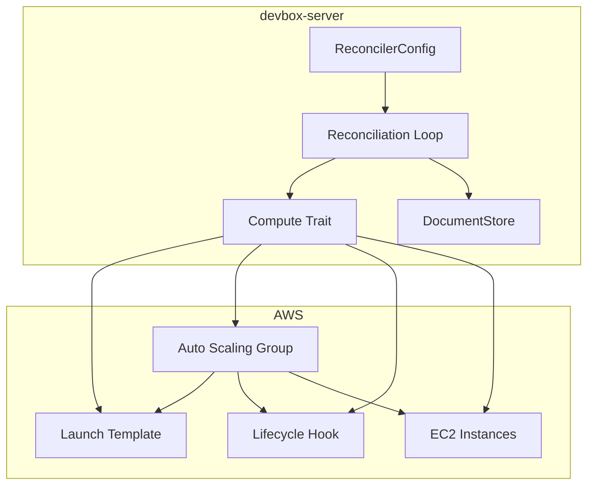
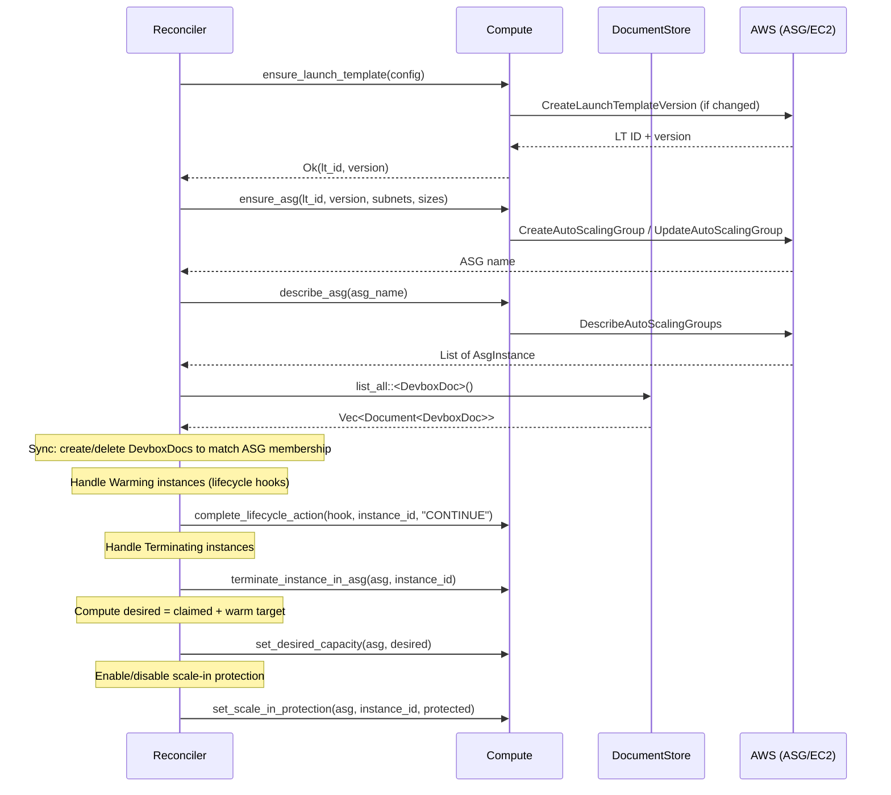
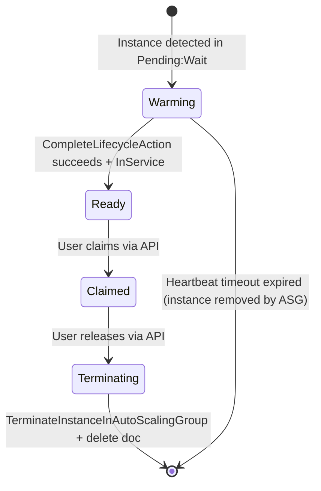

# Design Document: ASG Pool Management

> **Provisioning boundary update.** Sections below that have the reconciler **create or
> update** the Launch Template, ASG, or lifecycle hook (e.g. `ensure_launch_template`,
> `ensure_asg`, `ensure_lifecycle_hook`) are superseded: those resources are now
> **provisioned by Terraform** in `devbox-infra`, and the reconciler **adopts** them by name.
> The runtime operations (desired capacity, scale-in protection, owner tagging, termination,
> lifecycle completion, doc sync) are unchanged. See
> [`../infra-boundary/`](../infra-boundary/) for the authoritative split. The create-path
> material here is retained because it documents the exact AWS configuration Terraform must
> reproduce.

## Overview

This design replaces the current direct EC2 `RunInstances`/`TerminateInstances` approach with an Auto Scaling Group (ASG) backed pool. The reconciler shifts from instance-level CRUD to pool-level capacity management, where:

- A **Launch Template** defines instance configuration (AMI, instance type, security groups, IMDSv2, EBS encryption)
- An **ASG** manages the fleet — AWS handles health checks, AZ distribution, and replacement
- **DesiredCapacity** is computed as `claimed_count + target_warm_pool_size`
- **Claiming** means tagging an available instance from the ASG pool
- A **Lifecycle Hook** holds newly launched instances until warm-up completes

The `Compute` trait is redesigned from instance-level methods (`launch_instance`, `terminate_instance`, `describe_instance`) to pool-level operations (`ensure_launch_template`, `ensure_asg`, `set_desired_capacity`, `terminate_instance_in_asg`, `complete_lifecycle_action`, `describe_asg`, `tag_instance`).

## Architecture



### Reconciliation Tick Flow (New)



## Components and Interfaces

### Compute Trait (Redesigned)

The trait moves from instance-level to pool-level operations. Each method maps to one or more AWS API calls.

```rust
/// Result of ensuring a Launch Template.
#[derive(Debug, Clone)]
pub struct LaunchTemplateResult {
    /// Launch Template ID (e.g., "lt-0123456789abcdef0").
    pub id: String,
    /// Version number of the active template version.
    pub version: i64,
}

/// A single instance record from an ASG describe call.
#[derive(Debug, Clone)]
pub struct AsgInstance {
    /// EC2 instance ID.
    pub instance_id: String,
    /// ASG lifecycle state (e.g., "Pending:Wait", "InService", "Terminating").
    pub lifecycle_state: String,
    /// Health status ("Healthy" or "Unhealthy").
    pub health_status: String,
    /// Whether scale-in protection is enabled.
    pub protected_from_scale_in: bool,
}

/// Result of describing an ASG.
#[derive(Debug, Clone)]
pub struct AsgDescription {
    /// Current desired capacity.
    pub desired_capacity: u32,
    /// Configured minimum size.
    pub min_size: u32,
    /// Configured maximum size.
    pub max_size: u32,
    /// Launch Template ID currently referenced.
    pub launch_template_id: Option<String>,
    /// Launch Template version currently referenced.
    pub launch_template_version: Option<String>,
    /// Instances in the ASG.
    pub instances: Vec<AsgInstance>,
}

/// Configuration for creating/updating a Launch Template.
#[derive(Debug, Clone)]
pub struct LaunchTemplateConfig {
    pub name: String,
    pub ami_id: String,
    pub instance_type: String,
    /// Number of vCPUs required (used for InstanceRequirements-based selection).
    pub cpu: u32,
    /// Memory in MiB required (used for InstanceRequirements-based selection).
    pub memory_mib: u32,
    pub security_group_ids: Vec<String>,
    pub pool_id: String,
    pub managed_by: String,
}

/// Configuration for creating/updating an ASG.
#[derive(Debug, Clone)]
pub struct AsgConfig {
    pub name: String,
    pub launch_template_id: String,
    pub launch_template_version: i64,
    pub subnet_ids: Vec<String>,
    pub min_size: u32,
    pub max_size: u32,
    pub desired_capacity: u32,
    pub health_check_grace_period: u32,
    /// Whether to propagate ASG-level tags to instances at launch.
    pub propagate_tags_at_launch: bool,
    pub pool_id: String,
    pub managed_by: String,
}

/// Configuration for a lifecycle hook.
#[derive(Debug, Clone)]
pub struct LifecycleHookConfig {
    pub asg_name: String,
    pub hook_name: String,
    pub heartbeat_timeout_secs: u32,
}

/// Trait defining pool-level compute operations needed by the Reconciler.
pub trait Compute: Send + Sync {
    /// Ensure a Launch Template exists with the given configuration.
    /// Creates a new version if config differs from current, or creates
    /// the template if it doesn't exist. When cpu and memory_mib are set,
    /// configures InstanceRequirements (VCpuCount, MemoryMiB) for flexible
    /// instance type selection.
    ///
    /// # Errors
    /// Returns an error if the AWS API call fails.
    fn ensure_launch_template(
        &self,
        config: &LaunchTemplateConfig,
    ) -> impl Future<Output = Result<LaunchTemplateResult>> + Send;

    /// Ensure an ASG exists with the given configuration.
    /// Creates the ASG if absent, updates if config differs.
    /// When propagate_tags_at_launch is true, applies all ASG tags
    /// with PropagateAtLaunch=true via CreateOrUpdateTags.
    ///
    /// # Errors
    /// Returns an error if the AWS API call fails.
    fn ensure_asg(
        &self,
        config: &AsgConfig,
    ) -> impl Future<Output = Result<String>> + Send;

    /// Ensure a lifecycle hook is attached to the ASG.
    ///
    /// # Errors
    /// Returns an error if the AWS API call fails.
    fn ensure_lifecycle_hook(
        &self,
        config: &LifecycleHookConfig,
    ) -> impl Future<Output = Result<()>> + Send;

    /// Set the desired capacity of the named ASG.
    ///
    /// # Errors
    /// Returns an error if the AWS API call fails.
    fn set_desired_capacity(
        &self,
        asg_name: &str,
        desired: u32,
    ) -> impl Future<Output = Result<()>> + Send;

    /// Describe the ASG, returning its current configuration and instance list.
    ///
    /// # Errors
    /// Returns an error if the ASG is not found or the API call fails.
    fn describe_asg(
        &self,
        asg_name: &str,
    ) -> impl Future<Output = Result<AsgDescription>> + Send;

    /// Terminate a specific instance in the ASG without decrementing
    /// desired capacity (the ASG will launch a replacement).
    ///
    /// # Errors
    /// Returns an error if the AWS API call fails.
    fn terminate_instance_in_asg(
        &self,
        instance_id: &str,
        should_decrement: bool,
    ) -> impl Future<Output = Result<()>> + Send;

    /// Complete a lifecycle action for the given hook and instance.
    ///
    /// # Errors
    /// Returns an error if the AWS API call fails.
    fn complete_lifecycle_action(
        &self,
        asg_name: &str,
        hook_name: &str,
        instance_id: &str,
        action_result: &str,
    ) -> impl Future<Output = Result<()>> + Send;

    /// Apply key-value tags to an EC2 instance.
    ///
    /// # Errors
    /// Returns an error if the AWS API call fails.
    fn tag_instance(
        &self,
        instance_id: &str,
        tags: &[(&str, &str)],
    ) -> impl Future<Output = Result<()>> + Send;

    /// Set or remove scale-in protection on an instance within an ASG.
    ///
    /// # Errors
    /// Returns an error if the AWS API call fails.
    fn set_scale_in_protection(
        &self,
        asg_name: &str,
        instance_ids: &[&str],
        protected: bool,
    ) -> impl Future<Output = Result<()>> + Send;
}
```

### Ec2 Implementation

The production `Ec2` struct holds both an `aws_sdk_ec2::Client` and an `aws_sdk_autoscaling::Client`:

```rust
pub struct Ec2 {
    ec2_client: aws_sdk_ec2::Client,
    asg_client: aws_sdk_autoscaling::Client,
}

impl Ec2 {
    pub fn new(config: &aws_config::SdkConfig) -> Self {
        Self {
            ec2_client: aws_sdk_ec2::Client::new(config),
            asg_client: aws_sdk_autoscaling::Client::new(config),
        }
    }
}
```

Key implementation notes:
- `ensure_launch_template`: Uses `DescribeLaunchTemplates` to check existence, then `CreateLaunchTemplate` or `CreateLaunchTemplateVersion` as needed. Sets `HttpTokens = "required"`, `HttpPutResponseHopLimit = 2`, EBS encryption enabled, and cost-tracking tags. When `cpu` and `memory_mib` are specified, configures `InstanceRequirements` with `VCpuCount` (min/max = cpu) and `MemoryMiB` (min/max = memory_mib) as an alternative to a fixed `instance_type`. If both `instance_type` and cpu/memory are provided, `InstanceRequirements` takes precedence for flexible instance selection.
- `ensure_asg`: Uses `DescribeAutoScalingGroups` to check existence, then `CreateAutoScalingGroup` or `UpdateAutoScalingGroup`. Health check type "EC2", grace period 300s. When `propagate_tags_at_launch` is true (always set by the Ec2 implementation), all ASG-level tags are applied with `PropagateAtLaunch = true` via `CreateOrUpdateTags`, ensuring newly launched instances automatically inherit pool identifier, managed-by, and other ASG tags without a separate tagging step.
- `ensure_lifecycle_hook`: Uses `PutLifecycleHook` (idempotent — creates or updates).
- `terminate_instance_in_asg`: Uses `TerminateInstanceInAutoScalingGroup` with the `ShouldDecrementDesiredCapacity` parameter.
- `set_scale_in_protection`: Uses `SetInstanceProtection`.

### MockCompute Implementation

The mock tracks internal state for deterministic testing without AWS calls:

```rust
pub struct MockCompute {
    /// Internal ASG state: instances with their lifecycle states.
    asg_state: Arc<Mutex<MockAsgState>>,
    /// Error injection.
    errors: Arc<Mutex<MockErrors>>,
    /// Counter for generating deterministic instance IDs.
    next_id: Arc<AtomicU64>,
}

struct MockAsgState {
    launch_template: Option<MockLaunchTemplate>,
    asg: Option<MockAsg>,
    instances: HashMap<String, MockInstance>,
}

struct MockLaunchTemplate {
    id: String,
    version: i64,
    config: LaunchTemplateConfig,
}

struct MockAsg {
    name: String,
    desired_capacity: u32,
    min_size: u32,
    max_size: u32,
    lifecycle_hook: Option<LifecycleHookConfig>,
}

struct MockInstance {
    instance_id: String,
    lifecycle_state: String,
    health_status: String,
    protected_from_scale_in: bool,
    tags: HashMap<String, String>,
}
```

The mock provides helper methods for tests:
- `add_instance(lifecycle_state)` — inject an instance into the mock ASG
- `set_instance_lifecycle_state(id, state)` — simulate lifecycle transitions
- `set_error(method, error)` — inject errors for specific methods
- `get_instance_tags(id)` — inspect tags applied during claim

### Module Structure Changes

```
src/compute/
├── mod.rs          // Trait definition + types (LaunchTemplateResult, AsgInstance, etc.)
├── ec2.rs          // Production Ec2 impl (aws-sdk-ec2 + aws-sdk-autoscaling)
└── mock.rs         // MockCompute for testing (cfg(test) or feature = "test-utils")
```

New dependency needed in workspace `Cargo.toml`:
```toml
aws-sdk-autoscaling = { version = "=1.x.x", default-features = false }
```

And in `crates/devbox-server/Cargo.toml`:
```toml
aws-sdk-autoscaling = { workspace = true, features = ["rt-tokio", "default-https-client", "behavior-version-latest"] }
```

### Reconciliation Tick (Redesigned)

The tick changes from direct instance management to ASG capacity management:

```rust
pub(super) async fn reconciliation_tick(
    store: &DocumentStore,
    compute: &(impl Compute + ?Sized),
    config: &ReconcilerConfig,
) -> Result<()> {
    // Step 1: Ensure Launch Template
    let lt = compute.ensure_launch_template(&config.to_launch_template_config()).await?;

    // Step 2: Compute initial desired capacity from DB state
    let all_docs = store.list_all::<DevboxDoc>().await?;
    let claimed_count = count_by_state(&all_docs, DevboxState::Claimed);
    let initial_desired = claimed_count.saturating_add(config.target_warm_pool_size);

    // Step 3: Ensure ASG exists
    let asg_name = compute.ensure_asg(&AsgConfig {
        name: config.asg_name(),
        launch_template_id: lt.id,
        launch_template_version: lt.version,
        subnet_ids: config.subnet_ids.iter().map(|s| s.0.clone()).collect(),
        min_size: 0,
        max_size: config.max_pool_size,
        desired_capacity: initial_desired,
        health_check_grace_period: 300,
        propagate_tags_at_launch: true,
        pool_id: config.pool_id.clone(),
        managed_by: config.server_id.clone(),
    }).await?;

    // Step 4: Ensure lifecycle hook
    compute.ensure_lifecycle_hook(&LifecycleHookConfig {
        asg_name: asg_name.clone(),
        hook_name: config.lifecycle_hook_name(),
        heartbeat_timeout_secs: config.lifecycle_hook_timeout_secs(),
    }).await?;

    // Step 5: Describe ASG to get current instances
    let asg_desc = compute.describe_asg(&asg_name).await?;

    // Step 6: Sync DevboxDoc records with ASG membership
    let all_docs = store.list_all::<DevboxDoc>().await?;
    sync_docs_with_asg(store, compute, &all_docs, &asg_desc, config).await;

    // Step 7: Handle Warming instances (complete lifecycle actions)
    handle_warming_instances(store, compute, &asg_name, config).await;

    // Step 8: Handle Terminating instances
    handle_terminating_instances(store, compute).await;

    // Step 9: Recompute desired capacity and update if changed
    let current_docs = store.list_all::<DevboxDoc>().await?;
    let claimed = count_by_state(&current_docs, DevboxState::Claimed);
    let desired = claimed.saturating_add(config.target_warm_pool_size)
        .min(config.max_pool_size);
    if desired != asg_desc.desired_capacity {
        compute.set_desired_capacity(&asg_name, desired).await?;
    }

    // Step 10: Update scale-in protection
    update_scale_in_protection(store, compute, &asg_name, &current_docs).await;

    Ok(())
}
```

### How Claiming/Releasing Works with ASG Model

**Claiming:**
1. HTTP handler receives `POST /api/v1/devboxes/claim`
2. Query DevboxDocs in `Ready` state, prefer matching instance_type, sort by `created_at` ascending (longest-waiting first)
3. `compare_and_update` the chosen doc: state → `Claimed`, set `owner`, set `claimed_at`
4. On next reconciler tick: apply `devbox:owner` tag to EC2 instance, enable scale-in protection, recompute desired capacity

**Releasing:**
1. HTTP handler receives `POST /api/v1/devboxes/{id}/release`
2. Verify owner matches, transition state to `Terminating`
3. On next reconciler tick: call `terminate_instance_in_asg(instance_id, should_decrement=false)`, delete DevboxDoc. The ASG automatically launches a replacement.

### Updated ReconcilerConfig

```rust
/// A strongly-typed security group ID.
#[derive(Debug, Clone, PartialEq, Eq, Hash, Serialize, Deserialize)]
#[serde(transparent)]
pub struct SecurityGroupId(pub String);

#[derive(Debug, Clone)]
pub struct ReconcilerConfig {
    // --- Pool identity ---
    /// Unique identifier for this pool (used in ASG/LT naming).
    pub pool_id: String,
    /// Unique identity of this server instance (for leader lock + tags).
    pub server_id: String,

    // --- Instance configuration ---
    /// EC2 instance type for pool instances.
    pub instance_type: InstanceType,
    /// AMI ID for pool instances.
    pub ami_id: AmiId,
    /// Number of vCPUs required for pool instances (used for InstanceRequirements).
    pub cpu: u32,
    /// Memory in MiB required for pool instances (used for InstanceRequirements).
    pub memory_mib: u32,
    /// Subnet IDs for multi-AZ distribution (1..=20).
    pub subnet_ids: Vec<SubnetId>,
    /// Security group IDs to apply (1..=5).
    pub security_group_ids: Vec<SecurityGroupId>,

    // --- Pool sizing ---
    /// Number of unclaimed Ready instances to maintain (1..=100).
    pub target_warm_pool_size: u32,
    /// Maximum total instances the ASG can have (1..=500, >= target_warm_pool_size).
    pub max_pool_size: u32,

    // --- Timing ---
    /// Interval between reconciliation ticks.
    pub polling_interval: Duration,
    /// Maximum time an instance may remain in Warming before stuck.
    pub stuck_threshold: Duration,
    /// Leader lock time-to-live.
    pub lock_ttl: Duration,
    /// Lifecycle hook heartbeat timeout (60..=7200 seconds).
    pub lifecycle_hook_timeout: Duration,
}
```

Config validation (enforced at construction):
- `subnet_ids.len()` must be in `1..=20`
- `security_group_ids.len()` must be in `1..=5`
- `target_warm_pool_size` must be in `1..=100`
- `max_pool_size` must be in `1..=500` and `>= target_warm_pool_size`
- `lifecycle_hook_timeout` must be in `60..=7200` seconds

Helper methods:
```rust
impl ReconcilerConfig {
    /// Deterministic ASG name derived from pool_id.
    pub fn asg_name(&self) -> String {
        format!("devbox-pool-{}", self.pool_id)
    }

    /// Deterministic Launch Template name.
    pub fn launch_template_name(&self) -> String {
        format!("devbox-lt-{}", self.pool_id)
    }

    /// Lifecycle hook name.
    pub fn lifecycle_hook_name(&self) -> String {
        format!("devbox-warmup-{}", self.pool_id)
    }

    /// Lifecycle hook timeout in seconds.
    pub fn lifecycle_hook_timeout_secs(&self) -> u32 { ... }

    /// Build a LaunchTemplateConfig from this config.
    pub fn to_launch_template_config(&self) -> LaunchTemplateConfig { ... }
}
```


## Data Models

### DevboxDoc (Updated)

The `DevboxDoc` struct remains largely unchanged but the lifecycle semantics shift:

```rust
#[derive(Debug, Clone, Serialize, Deserialize)]
pub struct DevboxDoc {
    /// EC2 instance ID (always set — comes from ASG membership).
    pub instance_id: Option<String>,
    /// Current state: Warming | Ready | Claimed | Terminating.
    /// Note: "Launching" state is removed — the ASG handles instance launch.
    /// Instances appear as "Warming" when detected in Pending:Wait.
    pub state: DevboxState,
    /// EC2 instance type.
    pub instance_type: InstanceType,
    /// AMI ID used.
    pub ami_id: AmiId,
    /// Subnet ID where launched.
    pub subnet_id: SubnetId,
    /// EBS volume ID (if attached).
    pub ebs_volume_id: Option<String>,
    /// Owner (user who claimed).
    pub owner: Option<String>,
    /// When claimed.
    pub claimed_at: Option<Timestamp>,
    /// When this DevboxDoc was created.
    pub created_at: Timestamp,
    /// Whether the EC2 tag for owner has been applied (for retry).
    pub owner_tag_applied: bool,
}
```

State transitions under the ASG model:



The `Launching` state from `DevboxState` is kept in the enum for backward compatibility but is no longer used by the ASG-based reconciler. The reconciler only creates DevboxDocs when it observes instances in the ASG (starting at `Warming`).

### DevboxState Enum (Updated)

```rust
#[derive(Debug, Clone, Copy, PartialEq, Eq, Serialize, Deserialize)]
#[serde(rename_all = "snake_case")]
pub enum DevboxState {
    /// Legacy — not used in ASG model. Kept for serde compat.
    Launching,
    /// Instance is in Pending:Wait, lifecycle hook active.
    Warming,
    /// Instance is InService and available for claim.
    Ready,
    /// Instance is claimed by a user.
    Claimed,
    /// Instance is being terminated.
    Terminating,
}
```

### ReconcilerConfig Validation

A builder or `validate()` method ensures all constraints hold at construction:

```rust
impl ReconcilerConfig {
    /// Validate config constraints. Returns Err with details on failure.
    pub fn validate(&self) -> Result<()> {
        if self.subnet_ids.is_empty() || self.subnet_ids.len() > 20 {
            anyhow::bail!("subnet_ids must contain 1..=20 entries, got {}", self.subnet_ids.len());
        }
        if self.security_group_ids.is_empty() || self.security_group_ids.len() > 5 {
            anyhow::bail!("security_group_ids must contain 1..=5 entries, got {}", self.security_group_ids.len());
        }
        if self.target_warm_pool_size < 1 || self.target_warm_pool_size > 100 {
            anyhow::bail!("target_warm_pool_size must be 1..=100, got {}", self.target_warm_pool_size);
        }
        if self.max_pool_size < 1 || self.max_pool_size > 500 {
            anyhow::bail!("max_pool_size must be 1..=500, got {}", self.max_pool_size);
        }
        if self.target_warm_pool_size > self.max_pool_size {
            anyhow::bail!(
                "target_warm_pool_size ({}) must not exceed max_pool_size ({})",
                self.target_warm_pool_size, self.max_pool_size
            );
        }
        let hook_secs = self.lifecycle_hook_timeout.as_secs();
        if hook_secs < 60 || hook_secs > 7200 {
            anyhow::bail!("lifecycle_hook_timeout must be 60..=7200 seconds, got {hook_secs}");
        }
        Ok(())
    }
}
```

### Capacity Computation

The capacity formula is deterministic and pure:

```rust
/// Compute the desired ASG capacity.
///
/// desired = min(claimed_count + target_warm_pool_size, max_pool_size)
fn compute_desired_capacity(
    claimed_count: u32,
    target_warm_pool_size: u32,
    max_pool_size: u32,
) -> u32 {
    claimed_count
        .saturating_add(target_warm_pool_size)
        .min(max_pool_size)
}
```

This is a pure function ideal for property-based testing.


## Correctness Properties

*A property is a characteristic or behavior that should hold true across all valid executions of a system — essentially, a formal statement about what the system should do. Properties serve as the bridge between human-readable specifications and machine-verifiable correctness guarantees.*

### Property 1: Launch Template Configuration Invariants

*For any* valid `LaunchTemplateConfig`, after calling `ensure_launch_template`, the resulting Launch Template SHALL always have IMDSv2 enforced (HttpTokens="required", HttpPutResponseHopLimit=2), EBS encryption enabled, tags containing the pool identifier and managed-by server_id, and when cpu and memory_mib are specified, InstanceRequirements with VCpuCount and MemoryMiB matching the configured values.

**Validates: Requirements 1.2, 1.3, 1.6, 9.7, 9.8**

### Property 2: Launch Template Idempotence

*For any* valid `LaunchTemplateConfig`, calling `ensure_launch_template` twice with the same config SHALL return the same `(id, version)` pair. Calling it with a config that differs in AMI ID, instance type, cpu, memory_mib, or security groups SHALL return the same `id` but a strictly greater `version` number.

**Validates: Requirements 1.1, 1.7**

### Property 3: Launch Template Version Pinning

*For any* `LaunchTemplateResult` returned by `ensure_launch_template`, the version number passed to `ensure_asg` in the `AsgConfig` SHALL equal that result's version number, never "$Latest" or "$Default".

**Validates: Requirements 1.5**

### Property 4: ASG Configuration Invariants

*For any* valid `ReconcilerConfig`, the ASG created or updated by the reconciler SHALL have health check type "EC2", health check grace period of 300 seconds, VPCZoneIdentifier containing all configured subnet_ids, a deterministic name derived from pool_id, tags containing the pool identifier and managed-by label, and all ASG-level tags configured with PropagateAtLaunch=true so that instances inherit tags at launch.

**Validates: Requirements 2.3, 2.4, 2.6, 2.8**

### Property 5: Capacity Computation

*For any* triple `(claimed_count, target_warm_pool_size, max_pool_size)` where all values are valid u32, `compute_desired_capacity` SHALL return `min(claimed_count + target_warm_pool_size, max_pool_size)`, and the result SHALL always be in the range `[0, max_pool_size]`.

**Validates: Requirements 3.1, 3.3, 4.7**

### Property 6: Document-ASG Sync Invariant

*For any* pair of (ASG instance set, DevboxDoc record set), after the sync step of a reconciliation tick completes: (a) every DevboxDoc's instance_id is present in the ASG instance set, and (b) every ASG instance in "Pending:Wait" or "InService" state that was not already tracked has a corresponding DevboxDoc created.

**Validates: Requirements 3.5, 6.5, 8.1, 8.3, 8.6**

### Property 7: Scale-In Protection for Claimed Instances

*For any* set of DevboxDoc records, after a reconciliation tick, every instance whose DevboxDoc state is `Claimed` SHALL have scale-in protection enabled, and every instance whose DevboxDoc state is not `Claimed` SHALL have scale-in protection disabled.

**Validates: Requirements 3.6**

### Property 8: Claim Selects Longest-Waiting Instance

*For any* non-empty set of Ready DevboxDocs with distinct `created_at` timestamps, a claim request SHALL select the DevboxDoc with the earliest `created_at` (longest-waiting), and after the claim the selected doc SHALL have state=Claimed, owner set to the request's owner, and claimed_at set to a non-None timestamp.

**Validates: Requirements 4.1, 4.4**

### Property 9: Claim Retry on Conflict

*For any* set of N Ready DevboxDocs where N ≥ 1, if `compare_and_update` fails on the first K candidates (0 ≤ K < N), the claim SHALL succeed by selecting the (K+1)th candidate. The claim SHALL fail with pool-exhausted only if all N candidates fail.

**Validates: Requirements 4.6**

### Property 10: Release Ownership Verification

*For any* DevboxDoc in Claimed state with owner X and a release request from owner Y: the release succeeds (transitions to Terminating) if and only if X == Y. If the doc is not in Claimed state or Y ≠ X, the release SHALL be rejected with an error.

**Validates: Requirements 5.1, 5.2**

### Property 11: Termination Cleanup

*For any* DevboxDoc in Terminating state with a non-None instance_id, the reconciler SHALL call `terminate_instance_in_asg` with `should_decrement=false`. Upon success, the DevboxDoc SHALL be deleted from the DocumentStore. For Terminating docs with no instance_id, the doc SHALL be deleted without any AWS call.

**Validates: Requirements 5.3, 5.4, 5.6**

### Property 12: Warming-to-Ready Lifecycle Progression

*For any* DevboxDoc in Warming state whose corresponding ASG instance transitions to "InService" lifecycle state, the reconciler SHALL transition the DevboxDoc state from Warming to Ready within the same reconciliation tick. For any ASG instance in "Pending:Wait" not yet tracked, the reconciler SHALL create a Warming DevboxDoc.

**Validates: Requirements 6.2, 6.6**

### Property 13: Optimistic Concurrency Safety

*For any* DevboxDoc update attempted via `compare_and_update`, if the document's current version does not match the expected version, the update SHALL return false (no data overwritten), and the reconciler SHALL skip that document without error or corruption.

**Validates: Requirements 8.4, 8.5**

### Property 14: Configuration Validation

*For any* `ReconcilerConfig` field values: `validate()` SHALL return Ok if and only if all of the following hold: `target_warm_pool_size` ∈ [1, 100], `max_pool_size` ∈ [1, 500], `max_pool_size ≥ target_warm_pool_size`, `subnet_ids.len()` ∈ [1, 20], `security_group_ids.len()` ∈ [1, 5], and `lifecycle_hook_timeout` ∈ [60s, 7200s]. Otherwise it SHALL return an Err identifying the invalid field.

**Validates: Requirements 9.1, 9.2, 9.3, 9.4, 9.5, 9.7, 9.8**

### Property 15: Owner Tag Application

*For any* DevboxDoc that transitions to Claimed state with owner O, on the next reconciliation tick the reconciler SHALL call `tag_instance` with a ("devbox:owner", O) tag pair for the doc's instance_id. If the tagging fails, the doc SHALL remain in Claimed state with `owner_tag_applied=false` and tagging SHALL be retried on subsequent ticks.

**Validates: Requirements 4.2**

## Error Handling

### Strategy

All AWS API calls are fallible. The reconciler follows a **log-and-retry** pattern:

1. **Transient failures** (network timeouts, throttling): Log at `warn` level, skip the operation, retry on the next tick.
2. **Permanent failures** (invalid parameters, missing permissions): Log at `error` level, retry anyway (the operator may fix config between ticks).
3. **Partial failures** (e.g., tagging fails after state transition): Use the `owner_tag_applied` flag to track incomplete operations and retry the remaining step.

### Error Propagation

- `ensure_launch_template` failure → entire tick aborts early (no point continuing without a valid LT).
- `ensure_asg` failure → entire tick aborts early (can't manage capacity without an ASG).
- `set_desired_capacity` failure → log and continue (current capacity is still functional).
- `terminate_instance_in_asg` failure → leave doc in Terminating state, retry next tick.
- `complete_lifecycle_action` failure → leave doc in Warming state, retry next tick.
- `tag_instance` failure → mark `owner_tag_applied = false`, retry next tick.
- `compare_and_update` version conflict → skip document, retry next tick.

### DocumentStore Errors

- Database connection failures: The existing `with_dsql_retry!` macro handles transient DSQL errors with automatic retry.
- Serialization failures: These indicate bugs and are propagated as errors (should never happen with well-formed types).

### Validation Errors

- `ReconcilerConfig::validate()` returns `anyhow::Result<()>` with a descriptive message identifying the invalid field and accepted range.
- Validation runs at startup before the reconciliation loop begins. Invalid config prevents the server from starting.

### No-Panic Guarantee

All error paths use `?` propagation or explicit `match` arms. No `unwrap()`, `expect()`, indexing, or arithmetic that could panic. This is enforced by the workspace clippy lints.

## Testing Strategy

### Property-Based Tests (proptest)

The project already uses `proptest` as a dev-dependency. Property tests run with minimum 100 iterations and use the mock `Compute` implementation.

**Configuration:**
```rust
proptest! {
    #![proptest_config(ProptestConfig::with_cases(100))]

    // Feature: asg-pool-management, Property 5: Capacity Computation
    #[test]
    fn prop_capacity_computation(
        claimed in 0u32..200,
        warm in 1u32..100,
        max in 1u32..500
    ) {
        // ...
    }
}
```

**Properties to implement as property-based tests:**
- Property 5 (Capacity Computation) — pure function, ideal for PBT
- Property 8 (Claim Selects Longest-Waiting) — generate random sets of Ready docs
- Property 9 (Claim Retry on Conflict) — generate random N and K values
- Property 10 (Release Ownership Verification) — generate random owner pairs
- Property 13 (Optimistic Concurrency Safety) — generate random version pairs
- Property 14 (Configuration Validation) — generate random config values across full range

**Tag format:** `// Feature: asg-pool-management, Property {N}: {title}`

### Unit Tests (Example-Based)

For behaviors that are specific scenarios or error injection:

- Launch Template creation failure → ASG not modified (Req 1.4)
- ASG creation failure → no instance modifications (Req 2.5)
- `set_desired_capacity` failure → state unchanged (Req 3.4)
- Capacity exceeds max → warning logged (Req 3.7)
- EC2 tagging failure → retry on next tick (Req 4.3)
- Pool exhausted → appropriate error (Req 4.5)
- Terminate failure → doc stays Terminating (Req 5.5)
- Lifecycle action failure → doc stays Warming (Req 6.4)
- Terminating doc with no instance_id → deleted without AWS call (Req 5.6)

### Integration Tests

For properties that involve real lifecycle sequences with the mock:

- Properties 1-4 (Launch Template + ASG invariants): Full reconciliation tick with MockCompute, verify all AWS invariants hold
- Properties 6, 7, 11, 12, 15: Multi-tick sequences testing state progression
- Property 3 (version pinning): End-to-end tick verifying LT version flows through to ASG

### Test Module Structure

```
src/reconcile/
├── tests.rs            // Integration tests using MockCompute + in-memory SQLite
src/compute/
├── mock.rs             // MockCompute with helpers
├── tests.rs            // Property tests for pure functions (capacity, validation)
```

### Dual Testing Balance

- **Property tests** cover universal invariants (capacity formula, config validation, claiming semantics, concurrency safety) — these run 100+ iterations with random inputs
- **Unit tests** cover specific error scenarios, edge cases, and integration between components — these use concrete examples
- Together they provide comprehensive coverage without excessive test count

