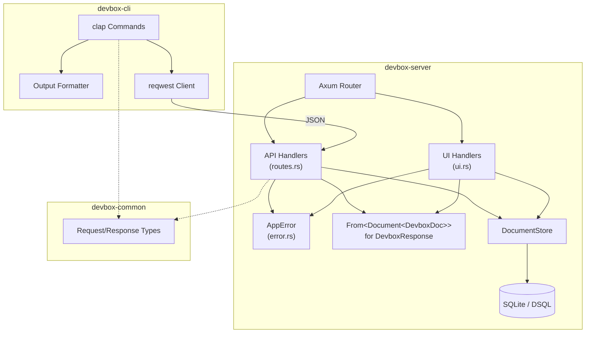
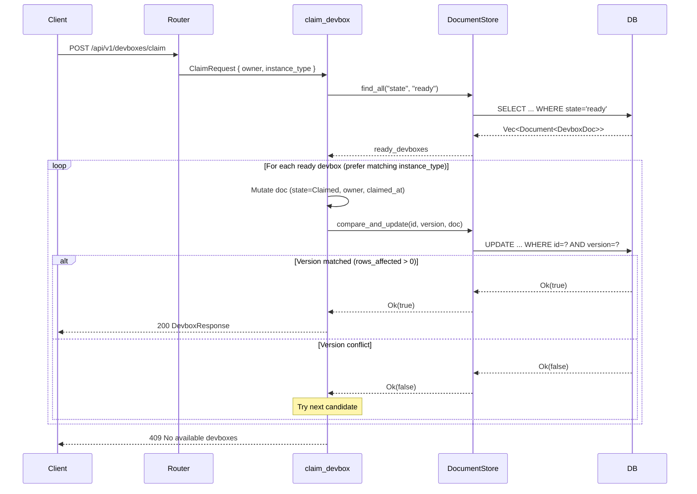

# Technical Design: Devbox Server UI & CLI

## Overview

This design describes how to wire the existing placeholder route handlers in `devbox-server` to the `DocumentStore`, add dashboard detail and action pages via Askama templates, and improve CLI output formatting. The implementation builds on the existing architecture: Axum for HTTP, `DocumentStore` for persistence (with optimistic concurrency via `compare_and_update`), Askama + TailwindCSS + rust-embed for the web UI, and clap + reqwest for the CLI.

**Key design decisions:**

1. **Conversion trait (`From<Document<DevboxDoc>>`)** — a single `impl From` maps the internal document representation to the API response type, used by both REST handlers and the UI layer.
2. **Structured error type (`AppError`)** — an enum implementing Axum's `IntoResponse` to produce consistent JSON error bodies across all API endpoints.
3. **Optimistic concurrency loop** — the claim handler uses `DocumentStore::compare_and_update` in a retry loop to guarantee exactly-one-winner semantics.
4. **Progressive enhancement UI** — the dashboard uses plain HTML forms that POST to the API, with server-side redirects on success (no JavaScript required).
5. **CLI table formatting** — a lightweight manual column-alignment approach using format strings (avoiding external table crate dependencies to keep the binary lean).

## Architecture



### Request Flow: Claim Devbox



## Components and Interfaces

### 1. Error Module (`src/error.rs`)

A new module introducing `AppError`, an enum that implements `IntoResponse` for uniform JSON error responses.

```rust
// src/error.rs

use axum::http::StatusCode;
use axum::response::{IntoResponse, Response, Json};
use serde::Serialize;

/// Structured JSON error body.
#[derive(Serialize)]
pub struct ErrorBody {
    pub error: String,
}

/// Application-level error type for route handlers.
pub enum AppError {
    /// 400 Bad Request — malformed input.
    BadRequest(String),
    /// 403 Forbidden — ownership mismatch.
    Forbidden(String),
    /// 404 Not Found — resource does not exist.
    NotFound(String),
    /// 409 Conflict — state conflict (e.g., no available devboxes).
    Conflict(String),
    /// 500 Internal Server Error — database or serialization failure.
    Internal(anyhow::Error),
}

impl IntoResponse for AppError {
    fn into_response(self) -> Response {
        let (status, message) = match self {
            Self::BadRequest(msg) => (StatusCode::BAD_REQUEST, msg),
            Self::Forbidden(msg) => (StatusCode::FORBIDDEN, msg),
            Self::NotFound(msg) => (StatusCode::NOT_FOUND, msg),
            Self::Conflict(msg) => (StatusCode::CONFLICT, msg),
            Self::Internal(err) => {
                tracing::error!("internal error: {err:#}");
                (StatusCode::INTERNAL_SERVER_ERROR, "internal server error".to_string())
            }
        };
        (status, Json(ErrorBody { error: message })).into_response()
    }
}

/// Convenience conversion: anyhow::Error → AppError::Internal
impl From<anyhow::Error> for AppError {
    fn from(err: anyhow::Error) -> Self {
        Self::Internal(err)
    }
}
```

### 2. Conversion Module (`src/convert.rs`)

Implements `From<Document<DevboxDoc>> for DevboxResponse` for uniform mapping across the codebase.

```rust
// src/convert.rs

use devbox_common::DevboxResponse;
use crate::db::document_type::Document;
use crate::documents::devbox::DevboxDoc;

impl From<Document<DevboxDoc>> for DevboxResponse {
    fn from(doc: Document<DevboxDoc>) -> Self {
        DevboxResponse {
            id: doc.id,
            instance_id: doc.data.instance_id,
            state: doc.data.state,
            instance_type: doc.data.instance_type,
            ami_id: doc.data.ami_id,
            owner: doc.data.owner,
            created_at: doc.created_at.to_string(),
            claimed_at: doc.data.claimed_at.map(|ts| ts.to_string()),
        }
    }
}
```

### 3. API Route Handlers (`src/routes.rs` — updated)

Replace placeholders with real implementations. All handlers return `Result<..., AppError>`.

#### `list_devboxes`

```rust
async fn list_devboxes(
    State(state): State<AppState>,
) -> Result<Json<DevboxListResponse>, AppError> {
    let docs = state.store.list_all::<DevboxDoc>().await?;
    let devboxes = docs.into_iter().map(DevboxResponse::from).collect();
    Ok(Json(DevboxListResponse { devboxes }))
}
```

#### `get_devbox`

```rust
async fn get_devbox(
    State(state): State<AppState>,
    Path(id): Path<String>,
) -> Result<Json<DevboxResponse>, AppError> {
    let doc = state.store.get::<DevboxDoc>(&id).await?
        .ok_or_else(|| AppError::NotFound(format!("devbox '{id}' not found")))?;
    Ok(Json(doc.into()))
}
```

#### `claim_devbox`

```rust
async fn claim_devbox(
    State(state): State<AppState>,
    Json(req): Json<ClaimRequest>,
) -> Result<Json<DevboxResponse>, AppError> {
    if req.owner.trim().is_empty() {
        return Err(AppError::BadRequest("owner field is required".into()));
    }

    let ready_docs = state.store.find_all::<DevboxDoc>("state", "ready").await?;
    if ready_docs.is_empty() {
        return Err(AppError::Conflict("no devboxes available".into()));
    }

    // Sort candidates: preferred instance_type first
    let mut candidates = ready_docs;
    if let Some(ref pref) = req.instance_type {
        candidates.sort_by(|a, b| {
            let a_match = a.data.instance_type == *pref;
            let b_match = b.data.instance_type == *pref;
            b_match.cmp(&a_match) // true (preferred) sorts first
        });
    }

    for candidate in candidates {
        let mut updated = candidate.data.clone();
        updated.state = DevboxState::Claimed;
        updated.owner = Some(req.owner.clone());
        updated.claimed_at = Some(jiff::Timestamp::now());

        let success = state.store
            .compare_and_update(&candidate.id, candidate.version, &updated)
            .await?;

        if success {
            // Re-fetch to get updated metadata
            let refreshed = state.store.get::<DevboxDoc>(&candidate.id).await?
                .ok_or_else(|| AppError::Internal(
                    anyhow::anyhow!("devbox vanished after claim")
                ))?;
            return Ok(Json(refreshed.into()));
        }
        // Version conflict — try next candidate
    }

    Err(AppError::Conflict("no devboxes available (all claimed concurrently)".into()))
}
```

#### `release_devbox`

```rust
async fn release_devbox(
    State(state): State<AppState>,
    Path(id): Path<String>,
    Json(req): Json<ReleaseRequest>,
) -> Result<Json<DevboxResponse>, AppError> {
    let doc = state.store.get::<DevboxDoc>(&id).await?
        .ok_or_else(|| AppError::NotFound(format!("devbox '{id}' not found")))?;

    if doc.data.state != DevboxState::Claimed {
        return Err(AppError::Conflict(format!(
            "cannot release devbox in '{}' state", doc.data.state
        )));
    }

    let current_owner = doc.data.owner.as_deref().unwrap_or("");
    if current_owner != req.owner {
        return Err(AppError::Forbidden("ownership mismatch".into()));
    }

    let mut updated = doc.data.clone();
    updated.state = DevboxState::Terminating;
    updated.owner = None;

    state.store.update(&id, &updated).await?;

    let refreshed = state.store.get::<DevboxDoc>(&id).await?
        .ok_or_else(|| AppError::Internal(anyhow::anyhow!("devbox vanished after release")))?;
    Ok(Json(refreshed.into()))
}
```

### 4. Dashboard UI Templates (`src/ui.rs` — extended)

#### New Templates

| Template | Route | Description |
|----------|-------|-------------|
| `DashboardTemplate` | `GET /` | Lists all devboxes (existing, enhanced with real data + links) |
| `DevboxDetailTemplate` | `GET /devboxes/{id}` | Full detail view with claim/release buttons |
| `ClaimFormTemplate` | `GET /devboxes/claim` | Form to submit a claim |
| `ErrorPageTemplate` | various | Generic error display within the UI shell |

#### Template Struct Definitions

```rust
#[derive(Template)]
#[template(path = "index.html")]
pub struct DashboardTemplate {
    pub devboxes: Vec<DashboardDevbox>,
    pub error: Option<String>,
}

#[derive(Template)]
#[template(path = "detail.html")]
pub struct DevboxDetailTemplate {
    pub devbox: DevboxDetail,
    pub error: Option<String>,
}

#[derive(Template)]
#[template(path = "claim_form.html")]
pub struct ClaimFormTemplate {
    pub instance_type: Option<String>,
    pub error: Option<String>,
}

#[derive(Template)]
#[template(path = "error.html")]
pub struct ErrorPageTemplate {
    pub title: String,
    pub message: String,
}
```

#### UI Handler Signatures

```rust
pub fn build_ui_router() -> Router<AppState> {
    Router::new()
        .route("/", get(dashboard))
        .route("/devboxes/{id}", get(devbox_detail))
        .route("/devboxes/claim", get(claim_form).post(submit_claim))
        .route("/devboxes/{id}/release", post(submit_release))
        .route("/static/{*path}", get(static_asset))
}
```

#### `dashboard` handler (updated)

```rust
async fn dashboard(State(state): State<AppState>) -> Response {
    match state.store.list_all::<DevboxDoc>().await {
        Ok(docs) => {
            let devboxes = docs.into_iter().map(|doc| DashboardDevbox {
                id: doc.id.clone(),
                state: doc.data.state.to_string(),
                instance_type: doc.data.instance_type.clone(),
                instance_id: doc.data.instance_id.clone().unwrap_or_default(),
                owner: doc.data.owner.clone().unwrap_or_default(),
                created_at: doc.created_at.to_string(),
            }).collect();
            DashboardTemplate { devboxes, error: None }.into_response()
        }
        Err(e) => {
            DashboardTemplate {
                devboxes: Vec::new(),
                error: Some(format!("Failed to load devboxes: {e}")),
            }.into_response()
        }
    }
}
```

### 5. CLI Output Formatter (`devbox-cli/src/format.rs`)

A new module with functions for formatting output.

```rust
// devbox-cli/src/format.rs

use devbox_common::{DevboxListResponse, DevboxResponse};

/// Format a list of devboxes as a table.
pub fn format_list_table(list: &DevboxListResponse) -> String {
    let header = format!(
        "{:<8}  {:<12}  {:<12}  {:<19}  {}",
        "ID", "STATE", "TYPE", "INSTANCE", "OWNER"
    );
    let separator = "-".repeat(header.len());
    let mut lines = vec![header, separator];

    for d in &list.devboxes {
        let id_short = truncate(&d.id, 8);
        let instance_short = truncate(
            d.instance_id.as_deref().unwrap_or("-"),
            19,
        );
        let owner = d.owner.as_deref().unwrap_or("-");
        lines.push(format!(
            "{:<8}  {:<12}  {:<12}  {:<19}  {}",
            id_short,
            format!("{:?}", d.state),
            d.instance_type,
            instance_short,
            owner,
        ));
    }
    lines.join("\n")
}

/// Format a single devbox in key-value style.
pub fn format_status(d: &DevboxResponse) -> String {
    let pairs = [
        ("ID", d.id.as_str()),
        ("State", &format!("{:?}", d.state)),
        ("Type", &d.instance_type),
        ("AMI", &d.ami_id),
        ("Instance", d.instance_id.as_deref().unwrap_or("-")),
        ("Owner", d.owner.as_deref().unwrap_or("-")),
        ("Created", &d.created_at),
        ("Claimed At", d.claimed_at.as_deref().unwrap_or("-")),
    ];
    pairs.iter()
        .map(|(k, v)| format!("  {:<12} {}", format!("{}:", k), v))
        .collect::<Vec<_>>()
        .join("\n")
}

/// Format a successful claim response.
pub fn format_claim_success(d: &DevboxResponse) -> String {
    let instance = d.instance_id.as_deref().unwrap_or("(pending)");
    format!(
        "Claimed devbox {}\n  Instance: {}\n  Type: {}\n  Connect: aws ssm start-session --target {}",
        &d.id, instance, &d.instance_type, instance
    )
}

/// Format a successful release response.
pub fn format_release_success(d: &DevboxResponse) -> String {
    format!("Released devbox {} (now {:?})", &d.id, d.state)
}

/// Truncate a string to max_len characters, appending "…" if truncated.
fn truncate(s: &str, max_len: usize) -> String {
    if s.len() <= max_len {
        s.to_string()
    } else {
        let end = max_len.saturating_sub(1);
        format!("{}…", &s[..end])
    }
}
```

### 6. Updated Module Structure

```
devbox-server/src/
├── convert.rs      (NEW - From<Document<DevboxDoc>> for DevboxResponse)
├── db/             (existing)
├── documents/      (existing)
├── ec2/            (existing - out of scope)
├── error.rs        (NEW - AppError enum)
├── lib.rs          (updated - add pub mod convert, error)
├── main.rs         (existing)
├── reconcile.rs    (existing - out of scope)
├── routes.rs       (UPDATED - real implementations)
└── ui.rs           (UPDATED - new templates + handlers)

devbox-server/templates/
├── index.html      (UPDATED - clickable rows, error display)
├── detail.html     (NEW - full devbox detail + action buttons)
├── claim_form.html (NEW - form for claiming)
└── error.html      (NEW - generic error page)

devbox-cli/src/
├── format.rs       (NEW - output formatting)
└── main.rs         (UPDATED - use format module, stderr for errors)
```

## Data Models

### Existing Types (unchanged)

| Type | Crate | Purpose |
|------|-------|---------|
| `DevboxDoc` | devbox-server | Internal document model stored in DB |
| `Document<T>` | devbox-server | Generic wrapper with metadata (id, version, timestamps) |
| `DevboxResponse` | devbox-common | API response representation |
| `DevboxListResponse` | devbox-common | List wrapper |
| `ClaimRequest` | devbox-common | Claim input |
| `ReleaseRequest` | devbox-common | Release input |
| `DevboxState` | devbox-common | Lifecycle enum (Launching, Warming, Ready, Claimed, Terminating) |

### New Types

#### `AppError` (devbox-server)

```rust
pub enum AppError {
    BadRequest(String),
    Forbidden(String),
    NotFound(String),
    Conflict(String),
    Internal(anyhow::Error),
}
```

#### `ErrorBody` (devbox-server)

```rust
#[derive(Serialize)]
pub struct ErrorBody {
    pub error: String,
}
```

#### `DevboxDetail` (devbox-server, UI layer)

Extended version of `DashboardDevbox` for the detail template:

```rust
pub struct DevboxDetail {
    pub id: String,
    pub state: String,
    pub instance_type: String,
    pub ami_id: String,
    pub subnet_id: String,
    pub instance_id: String,
    pub ebs_volume_id: String,
    pub owner: String,
    pub claimed_at: String,
    pub created_at: String,
}
```

#### Conversion: `Document<DevboxDoc>` → `DevboxDetail`

```rust
impl From<Document<DevboxDoc>> for DevboxDetail {
    fn from(doc: Document<DevboxDoc>) -> Self {
        DevboxDetail {
            id: doc.id,
            state: doc.data.state.to_string(),
            instance_type: doc.data.instance_type,
            ami_id: doc.data.ami_id,
            subnet_id: doc.data.subnet_id,
            instance_id: doc.data.instance_id.unwrap_or_default(),
            ebs_volume_id: doc.data.ebs_volume_id.unwrap_or_default(),
            owner: doc.data.owner.unwrap_or_default(),
            claimed_at: doc.data.claimed_at
                .map(|ts| ts.to_string())
                .unwrap_or_default(),
            created_at: doc.created_at.to_string(),
        }
    }
}
```

### Data Flow: Claim Operation

1. Client sends `ClaimRequest { owner: "alice", instance_type: Some("m5.large") }`
2. Handler queries `find_all::<DevboxDoc>("state", "ready")`
3. Candidates sorted: matching `instance_type` first
4. For each candidate:
   - Clone `DevboxDoc`, set `state = Claimed`, `owner = Some(req.owner)`, `claimed_at = now()`
   - Call `compare_and_update(id, current_version, &updated_doc)`
   - If `true`: re-fetch, convert via `From`, return 200
   - If `false`: loop to next candidate
5. All candidates exhausted → return 409

## Correctness Properties

*A property is a characteristic or behavior that should hold true across all valid executions of a system — essentially, a formal statement about what the system should do. Properties serve as the bridge between human-readable specifications and machine-verifiable correctness guarantees.*

### Property 1: List returns all inserted documents

*For any* set of DevboxDoc documents inserted into the DocumentStore, calling the list endpoint SHALL return a DevboxListResponse containing exactly those documents (same count, same IDs), each correctly converted to DevboxResponse format.

**Validates: Requirements 1.1**

### Property 2: Get by ID returns the correct document

*For any* DevboxDoc inserted into the DocumentStore, calling the get endpoint with that document's ID SHALL return a DevboxResponse whose fields match the original document's data and metadata.

**Validates: Requirements 2.1**

### Property 3: Claim transitions Ready to Claimed with correct fields

*For any* pool containing at least one Ready DevboxDoc and any valid owner string, calling the claim endpoint SHALL return a DevboxResponse with state=Claimed, owner equal to the requested owner, and a non-empty claimed_at timestamp.

**Validates: Requirements 3.1**

### Property 4: Claim prefers matching instance type

*For any* pool containing Ready devboxes of mixed instance types, and a claim request specifying an instance_type preference that exists in the pool, the returned DevboxResponse SHALL have an instance_type matching the preference.

**Validates: Requirements 3.3**

### Property 5: Release transitions Claimed to Terminating

*For any* DevboxDoc in the Claimed state with a known owner, calling release with the matching owner SHALL return a DevboxResponse with state=Terminating and owner=None.

**Validates: Requirements 4.1**

### Property 6: Release rejects non-Claimed state

*For any* DevboxDoc in a state other than Claimed (Launching, Warming, Ready, or Terminating), calling release SHALL return HTTP 409.

**Validates: Requirements 4.3**

### Property 7: Release rejects wrong owner

*For any* Claimed DevboxDoc with owner A, calling release with a different owner B (where A ≠ B) SHALL return HTTP 403.

**Validates: Requirements 4.4**

### Property 8: Dashboard renders all devbox fields with correct state CSS class

*For any* set of DevboxDoc documents, rendering the DashboardTemplate SHALL produce HTML containing each devbox's ID, state value, instance type, instance ID, owner, and creation time, and each state value SHALL be wrapped in an element with CSS class `status-{state_name}`.

**Validates: Requirements 5.1, 5.3**

### Property 9: Detail page renders all document fields

*For any* DevboxDoc with all fields populated, rendering the DevboxDetailTemplate SHALL produce HTML containing the devbox ID, state, instance type, AMI ID, subnet ID, instance ID, EBS volume ID, owner, claimed_at, and created_at values.

**Validates: Requirements 6.1**

### Property 10: Detail page shows correct action button per state

*For any* DevboxDoc in the Claimed state, the detail page SHALL contain a "Release" button. *For any* DevboxDoc in the Ready state, the detail page SHALL contain a "Claim" link/button. For other states, neither action button SHALL appear.

**Validates: Requirements 6.4, 6.5**

### Property 11: CLI list format includes columns with correct truncation

*For any* DevboxListResponse, the formatted list output SHALL contain one row per devbox with ID truncated to at most 8 characters, instance ID truncated to at most 19 characters, and the state, instance type, and owner values present.

**Validates: Requirements 8.1**

### Property 12: CLI status format includes all labeled fields

*For any* DevboxResponse, the formatted status output SHALL contain labeled entries for ID, State, Type, AMI, Instance, Owner, Created, and Claimed At, each with the corresponding value from the response.

**Validates: Requirements 8.2**

### Property 13: CLI claim format includes devbox info and SSM command

*For any* DevboxResponse representing a successful claim, the formatted claim output SHALL contain the devbox ID, instance ID, instance type, and the string "aws ssm start-session --target" followed by the instance ID.

**Validates: Requirements 8.3**

### Property 14: CLI release format includes ID and state

*For any* DevboxResponse representing a released devbox, the formatted release output SHALL contain the devbox ID and its current state value.

**Validates: Requirements 8.4**

### Property 15: All error responses have JSON "error" field

*For any* AppError variant (BadRequest, Forbidden, NotFound, Conflict, Internal), converting it to an HTTP response SHALL produce a JSON body containing an "error" key with a non-empty string value, and the HTTP status code SHALL match the variant's designated code.

**Validates: Requirements 9.1**

### Property 16: Document-to-DevboxResponse field mapping

*For any* valid Document<DevboxDoc>, converting to DevboxResponse SHALL map: doc.id → id, doc.data.instance_id → instance_id, doc.data.state → state, doc.data.instance_type → instance_type, doc.data.ami_id → ami_id, doc.data.owner → owner, doc.created_at (RFC 3339) → created_at, doc.data.claimed_at (RFC 3339 or None) → claimed_at.

**Validates: Requirements 10.1**

### Property 17: DevboxResponse serialization round-trip

*For any* valid Document<DevboxDoc>, converting to DevboxResponse, serializing to JSON, and deserializing back SHALL produce a DevboxResponse equal to the original conversion result.

**Validates: Requirements 10.2**

## Error Handling

### Strategy

All error paths use the `AppError` enum, which implements `IntoResponse` to produce uniform JSON error bodies. This avoids ad-hoc error formatting in handlers and ensures API consumers always receive a parseable `{ "error": "..." }` response.

### Error Categories and Status Codes

| Error Type | HTTP Status | When Used |
|-----------|-------------|-----------|
| `AppError::BadRequest` | 400 | Malformed JSON body, missing required fields, empty owner |
| `AppError::Forbidden` | 403 | Release attempt with non-matching owner |
| `AppError::NotFound` | 404 | Devbox ID not found in store |
| `AppError::Conflict` | 409 | No Ready devboxes available, release from non-Claimed state |
| `AppError::Internal` | 500 | Database errors, serialization failures |

### Error Propagation

1. **Store errors** — `anyhow::Error` from `DocumentStore` methods propagated via `?` operator, automatically converted to `AppError::Internal` via the `From<anyhow::Error>` impl.
2. **Validation errors** — Checked at the start of handlers (e.g., empty owner field → `AppError::BadRequest`).
3. **Business logic errors** — Explicitly constructed (e.g., `AppError::Conflict("no devboxes available")`).
4. **UI errors** — Dashboard handlers catch store errors and render them inline via the template's `error` field rather than returning raw JSON.

### Axum JSON Rejection Handling

Axum's built-in `Json` extractor produces a 422 for deserialization failures by default. To comply with Requirement 9.2 (400 for malformed bodies), we add a custom `JsonBody<T>` extractor:

```rust
pub struct JsonBody<T>(pub T);

#[axum::async_trait]
impl<T, S> axum::extract::FromRequest<S> for JsonBody<T>
where
    T: DeserializeOwned,
    S: Send + Sync,
{
    type Rejection = AppError;

    async fn from_request(req: Request, state: &S) -> Result<Self, Self::Rejection> {
        match axum::Json::<T>::from_request(req, state).await {
            Ok(axum::Json(value)) => Ok(JsonBody(value)),
            Err(rejection) => Err(AppError::BadRequest(rejection.body_text())),
        }
    }
}
```

### Logging

- `AppError::Internal` logs the full error chain at `error!` level before responding.
- Other variants log at `warn!` level with the request path context via a tracing middleware layer.

## Testing Strategy

### Dual Testing Approach

This feature uses both **unit/integration tests** and **property-based tests** for comprehensive coverage:

- **Property-based tests**: Verify universal correctness properties using the [`proptest`](https://crates.io/crates/proptest) crate (Rust's mature PBT library). Each property runs a minimum of 100 iterations with randomly generated inputs.
- **Unit tests**: Cover specific examples, edge cases, integration scenarios, and error paths that don't benefit from input randomization.

### Property-Based Testing Configuration

- **Library**: `proptest` (added as a dev-dependency to `devbox-server` and `devbox-cli`)
- **Iterations**: Minimum 100 per property (default `PROPTEST_CASES=256`)
- **Tag format**: Each property test includes a comment: `// Feature: devbox-server-ui-cli, Property {N}: {title}`
- **Generators**: Custom `Arbitrary` implementations (or `prop_compose!` strategies) for `DevboxDoc`, `Document<DevboxDoc>`, and `DevboxResponse`

### Test Organization

```
devbox-server/tests/
├── properties/
│   ├── mod.rs
│   ├── api_list_get.rs      (Properties 1, 2)
│   ├── api_claim.rs         (Properties 3, 4)
│   ├── api_release.rs       (Properties 5, 6, 7)
│   ├── ui_dashboard.rs      (Properties 8, 9, 10)
│   ├── error_format.rs      (Property 15)
│   └── conversion.rs        (Properties 16, 17)
└── integration/
    ├── claim_concurrency.rs (3.4 concurrent claim test)
    ├── dashboard_actions.rs (7.1, 7.2 form submission flow)
    └── error_scenarios.rs   (1.3, 2.2, 2.3, 5.4, 7.3, 8.5)

devbox-cli/tests/
└── properties/
    ├── mod.rs
    └── format.rs            (Properties 11, 12, 13, 14)
```

### Generator Strategy for DevboxDoc

```rust
use proptest::prelude::*;

prop_compose! {
    fn arb_devbox_state()(idx in 0..5usize) -> DevboxState {
        match idx {
            0 => DevboxState::Launching,
            1 => DevboxState::Warming,
            2 => DevboxState::Ready,
            3 => DevboxState::Claimed,
            _ => DevboxState::Terminating,
        }
    }
}

prop_compose! {
    fn arb_devbox_doc()(
        instance_id in proptest::option::of("[a-z]-[a-f0-9]{17}"),
        state in arb_devbox_state(),
        instance_type in prop_oneof!["m5.large", "m5.xlarge", "c5.2xlarge", "t3.medium"],
        ami_id in "ami-[a-f0-9]{8}",
        subnet_id in "subnet-[a-f0-9]{8}",
        ebs_volume_id in proptest::option::of("vol-[a-f0-9]{8}"),
        owner in proptest::option::of("[a-z]{3,10}@example\\.com"),
    ) -> DevboxDoc {
        DevboxDoc {
            instance_id,
            state,
            instance_type,
            ami_id,
            subnet_id,
            ebs_volume_id,
            owner,
            claimed_at: None,
            created_at: jiff::Timestamp::now(),
        }
    }
}
```

### Key Integration Tests (not PBT)

| Test | Requirement | What it verifies |
|------|-------------|-----------------|
| Concurrent claim race | 3.4 | Only one winner when two claims race on single devbox |
| CAS retry | 3.5 | Handler tries next candidate after version conflict |
| Dashboard form POST → redirect | 7.1, 7.2 | HTML form submission triggers API call and redirects |
| CLI stderr output | 8.5 | Error messages written to stderr with status code |
| Malformed JSON → 400 | 9.2 | Custom extractor returns 400 for bad payloads |

### Test Tooling

- **Server integration tests**: Use `axum::test::TestClient` (via `axum-test` or direct `tower::ServiceExt`) with an in-memory SQLite `DocumentStore`.
- **CLI format tests**: Pure function tests (no network) — call format functions with constructed data.
- **UI template tests**: Render templates directly with `askama::Template::render()` and assert on HTML substring presence.

