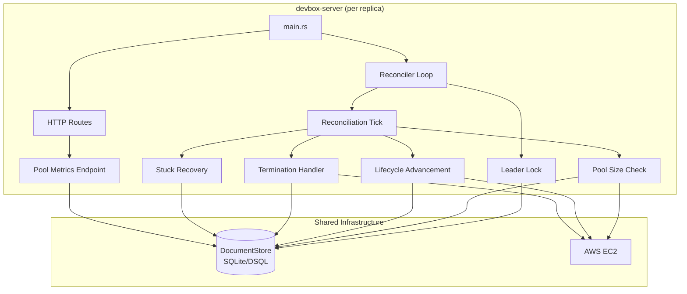
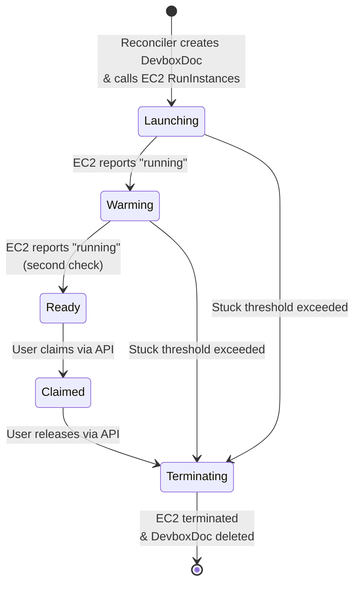
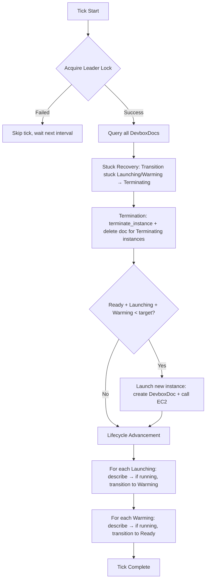

# Design Document: Pool Reconciliation

> **⚠️ Superseded.** This design predates the move to ASG-based pool management.
> It describes the reconciler launching and terminating individual EC2 instances
> directly. The current reconciler manages capacity through an Auto Scaling Group
> + Launch Template — see [`../asg-pool-management/`](../asg-pool-management/) and
> [`/CLAUDE.md`](../../../CLAUDE.md). Retained for history.

## Overview

The Pool Reconciliation system is a background subsystem of the devbox-server that maintains a configurable number of ready-to-use EC2 instances. It runs as a tokio background task, periodically inspecting the state of DevboxDoc records in the DocumentStore and taking corrective actions: launching new instances when the pool is below target, advancing instances through lifecycle states, terminating decommissioned instances, and recovering from stuck states.

The system is designed for stateless, multi-instance deployment. A distributed leader lock ensures only one server replica actively performs reconciliation actions at a time, while optimistic concurrency (compare_and_update) protects against race conditions on individual document transitions.

### Key Design Goals

- **Stateless operation**: No in-memory state between ticks; all state derived from DocumentStore
- **Crash safety**: Safe to restart at any point without duplicate launches or orphaned resources
- **Observability**: Structured tracing at every decision point; pool metrics API endpoint
- **Testability**: Trait-based EC2 abstraction with mock implementation for deterministic tests
- **Strict correctness**: All state transitions use optimistic concurrency; leader lock prevents duplicate actions across replicas

## Architecture



### State Machine



### Reconciliation Tick Flow



## Components and Interfaces

### 1. ReconcilerConfig

Configuration struct with defaults, constructible from environment variables or explicit values.

```rust
/// Configuration for the pool reconciliation system.
#[derive(Debug, Clone)]
pub struct ReconcilerConfig {
    /// Number of Ready instances to maintain.
    pub target_pool_size: u32,
    /// EC2 instance type for new launches.
    pub instance_type: String,
    /// AMI ID for new launches.
    pub ami_id: String,
    /// Subnet ID for new launches.
    pub subnet_id: String,
    /// Interval between reconciliation ticks.
    pub polling_interval: Duration,
    /// Maximum time an instance may remain in Launching/Warming before being considered stuck.
    pub stuck_threshold: Duration,
    /// Leader lock time-to-live.
    pub lock_ttl: Duration,
    /// Unique identity of this server instance (for leader lock).
    pub server_id: String,
}

impl Default for ReconcilerConfig {
    fn default() -> Self {
        Self {
            target_pool_size: 2,
            instance_type: "m5.large".to_string(),
            ami_id: String::new(),
            subnet_id: String::new(),
            polling_interval: Duration::from_secs(30),
            stuck_threshold: Duration::from_secs(600), // 10 minutes
            lock_ttl: Duration::from_secs(60),
            server_id: uuid::Uuid::now_v7().to_string(),
        }
    }
}
```

### 2. Ec2Client Trait (Refined)

The existing trait is refined to use `async_trait` semantics (or RPITIT as currently defined) and return richer status information.

```rust
/// EC2 instance status returned by describe_instance.
#[derive(Debug, Clone, PartialEq, Eq)]
pub enum InstanceStatus {
    Pending,
    Running,
    ShuttingDown,
    Terminated,
    Stopping,
    Stopped,
    Unknown(String),
}

/// Trait defining EC2 operations needed by the Reconciler.
pub trait Ec2Client: Send + Sync {
    /// Launch a new EC2 instance. Returns the instance ID.
    fn launch_instance(
        &self,
        instance_type: &str,
        ami_id: &str,
        subnet_id: &str,
    ) -> impl Future<Output = Result<String>> + Send;

    /// Terminate an EC2 instance by instance ID.
    fn terminate_instance(
        &self,
        instance_id: &str,
    ) -> impl Future<Output = Result<()>> + Send;

    /// Describe the current status of an EC2 instance.
    fn describe_instance(
        &self,
        instance_id: &str,
    ) -> impl Future<Output = Result<InstanceStatus>> + Send;
}
```

### 3. RealEc2Client

Production implementation using `aws-sdk-ec2`.

```rust
/// Production EC2 client using the AWS SDK.
pub struct RealEc2Client {
    client: aws_sdk_ec2::Client,
}

impl RealEc2Client {
    /// Create a new RealEc2Client from the AWS SDK config.
    pub fn new(config: &aws_config::SdkConfig) -> Self {
        Self {
            client: aws_sdk_ec2::Client::new(config),
        }
    }
}
```

Key implementation details:
- `launch_instance`: Calls `run_instances` with `min_count(1)`, `max_count(1)`, extracts instance ID from response
- `terminate_instance`: Calls `terminate_instances` with the single instance ID
- `describe_instance`: Calls `describe_instances` with instance ID filter, maps state name string to `InstanceStatus` enum
- All errors are propagated via `anyhow::Error` with contextual messages

### 4. MockEc2Client

Test implementation with configurable behavior.

```rust
/// Mock EC2 client for testing.
pub struct MockEc2Client {
    /// Internal instance state: instance_id → (state, describe_call_count)
    instances: Arc<Mutex<HashMap<String, MockInstance>>>,
    /// Number of describe calls before transitioning from pending → running.
    calls_to_running: u32,
    /// Optional error injection.
    errors: Arc<Mutex<MockErrors>>,
    /// Counter for generating synthetic instance IDs.
    next_id: Arc<AtomicU64>,
}

struct MockInstance {
    state: InstanceStatus,
    describe_calls: u32,
}

struct MockErrors {
    launch_error: Option<String>,
    terminate_error: Option<String>,
    describe_error: Option<String>,
}
```

### 5. Leader Lock (LeaderLockDoc)

A new document type for distributed coordination.

```rust
/// Document type for the distributed leader lock.
#[derive(Debug, Clone, Serialize, Deserialize)]
pub struct LeaderLockDoc {
    /// Identity of the server holding the lock.
    pub holder_id: String,
    /// When the lock expires (UTC timestamp).
    pub expires_at: Timestamp,
}

impl DocumentType for LeaderLockDoc {
    const DOC_TYPE: &'static str = "leader_lock";

    fn index_entries(&self) -> Vec<IndexEntry> {
        vec![IndexEntry {
            field: "holder_id",
            value: self.holder_id.clone(),
        }]
    }

    fn expires_at(&self) -> Option<Timestamp> {
        Some(self.expires_at)
    }
}
```

Lock acquisition algorithm:
1. Try to get the lock document by well-known ID (`"reconciler-leader-lock"`)
2. If no document exists → insert new lock with current server_id and TTL expiry
3. If document exists and `expires_at < now` → lock is expired, use `compare_and_update` to claim it
4. If document exists and `holder_id == self.server_id` → renew by updating `expires_at` via `compare_and_update`
5. If document exists and `holder_id != self.server_id` and not expired → lock held by another, skip tick

### 6. Reconciler Loop (spawn_reconciliation_loop)

Updated signature:

```rust
pub fn spawn_reconciliation_loop(
    store: Arc<DocumentStore>,
    ec2: Arc<dyn Ec2Client>,
    config: ReconcilerConfig,
    cancel: CancellationToken,
) -> JoinHandle<()>
```

The loop structure:

```rust
loop {
    tokio::select! {
        _ = interval.tick() => {
            match try_acquire_lock(&store, &config).await {
                Ok(true) => {
                    if let Err(e) = reconciliation_tick(&store, &ec2, &config).await {
                        tracing::error!(error = %e, "reconciliation tick failed");
                    }
                }
                Ok(false) => {
                    tracing::debug!("another instance holds the leader lock, skipping tick");
                }
                Err(e) => {
                    tracing::error!(error = %e, "failed to acquire leader lock");
                }
            }
        }
        () = cancel.cancelled() => {
            tracing::info!("reconciliation loop shutting down");
            break;
        }
    }
}
```

### 7. Reconciliation Tick Logic

The `reconciliation_tick` function performs these steps in order:

```rust
async fn reconciliation_tick(
    store: &DocumentStore,
    ec2: &dyn Ec2Client,
    config: &ReconcilerConfig,
) -> Result<()>
```

**Step 1: Query all DevboxDocs**
```rust
let all_docs = store.list_all::<DevboxDoc>().await?;
```

**Step 2: Stuck Recovery**
For each doc in `Launching` or `Warming` state where `now - doc.updated_at > stuck_threshold`:
- Transition to `Terminating` via `compare_and_update`
- Log at warn level

**Step 3: Terminate instances**
For each doc in `Terminating` state:
- If `instance_id` is `Some`: call `ec2.terminate_instance(id)`, then `store.delete(doc_id)` on success
- If `instance_id` is `None`: call `store.delete(doc_id)` directly
- On terminate error: log and skip (retry next tick)

**Step 4: Pool size check and launch**
Count docs in `Launching + Warming + Ready` states. While count < `target_pool_size`:
- Create a new `DevboxDoc` with state `Launching`, no `instance_id`
- Insert into store
- Call `ec2.launch_instance(...)` 
- On success: update doc with `instance_id` via `compare_and_update`
- On error: log error, leave doc in `Launching` (will be caught by stuck recovery if persistent)

**Step 5: Lifecycle advancement**
For each doc in `Launching` state (with `instance_id`):
- Call `ec2.describe_instance(instance_id)`
- If `Running`: transition to `Warming` via `compare_and_update`
- On describe error or non-running: skip

For each doc in `Warming` state:
- Call `ec2.describe_instance(instance_id)`
- If `Running`: transition to `Ready` via `compare_and_update`
- On describe error or non-running: skip

### 8. Pool Metrics Endpoint

```rust
/// Pool metrics response.
#[derive(Debug, Clone, Serialize, Deserialize)]
pub struct PoolMetricsResponse {
    pub launching: u32,
    pub warming: u32,
    pub ready: u32,
    pub claimed: u32,
    pub terminating: u32,
    pub target_pool_size: u32,
    /// Positive = deficit (need more Ready), negative = surplus
    pub ready_delta: i32,
}
```

Route: `GET /api/v1/pool/metrics`

Handler queries `store.list_all::<DevboxDoc>()`, counts instances by state, and computes `ready_delta = target_pool_size - ready_count`.

### 9. Module Structure

```
crates/devbox-server/src/
├── ec2/
│   ├── mod.rs          # Ec2Client trait, InstanceStatus enum
│   ├── real.rs         # RealEc2Client implementation
│   └── mock.rs         # MockEc2Client implementation (cfg(test) or feature-gated)
├── reconcile/
│   ├── mod.rs          # spawn_reconciliation_loop, public API
│   ├── config.rs       # ReconcilerConfig
│   ├── lock.rs         # LeaderLockDoc, try_acquire_lock, release_lock
│   ├── tick.rs         # reconciliation_tick, step functions
│   └── tests.rs        # Integration tests using MockEc2Client
├── documents/
│   ├── mod.rs
│   ├── devbox.rs       # DevboxDoc (existing)
│   └── leader_lock.rs  # LeaderLockDoc
├── routes.rs           # Updated with pool metrics route
└── ...
```

### 10. Updated AppState

```rust
#[derive(Clone)]
pub struct AppState {
    pub store: Arc<DocumentStore>,
    pub reconciler_config: Arc<ReconcilerConfig>,
}
```

The `ReconcilerConfig` is added to `AppState` so the metrics endpoint can report `target_pool_size`.

## Data Models

### DevboxDoc (existing, unchanged)

| Field | Type | Description |
|-------|------|-------------|
| instance_id | Option\<String\> | EC2 instance ID, set after launch |
| state | DevboxState | Current lifecycle state |
| instance_type | String | EC2 instance type |
| ami_id | String | AMI used for launch |
| subnet_id | String | Subnet for launch |
| ebs_volume_id | Option\<String\> | Attached EBS volume |
| owner | Option\<String\> | Claiming user |
| claimed_at | Option\<Timestamp\> | When claimed |
| created_at | Timestamp | Record creation time |

**Indexes**: `state`, `owner`, `instance_id`

### LeaderLockDoc (new)

| Field | Type | Description |
|-------|------|-------------|
| holder_id | String | Server instance identity |
| expires_at | Timestamp | UTC expiration of the lock |

**Indexes**: `holder_id`

Well-known document ID: `"reconciler-leader-lock"` (singleton pattern — only one document of this type exists).

### PoolMetricsResponse (new, API response)

| Field | Type | Description |
|-------|------|-------------|
| launching | u32 | Count in Launching state |
| warming | u32 | Count in Warming state |
| ready | u32 | Count in Ready state |
| claimed | u32 | Count in Claimed state |
| terminating | u32 | Count in Terminating state |
| target_pool_size | u32 | Configured target |
| ready_delta | i32 | target - ready (positive = deficit) |

### InstanceStatus (new, internal enum)

Maps EC2 instance state name strings to a Rust enum: `Pending`, `Running`, `ShuttingDown`, `Terminated`, `Stopping`, `Stopped`, `Unknown(String)`.

## Correctness Properties

*A property is a characteristic or behavior that should hold true across all valid executions of a system—essentially, a formal statement about what the system should do. Properties serve as the bridge between human-readable specifications and machine-verifiable correctness guarantees.*

### Property 1: Pool Size Maintenance Invariant

*For any* pool state (a set of DevboxDocs in various lifecycle states) and any target_pool_size, the reconciler SHALL launch a new instance if and only if the combined count of documents in Launching, Warming, and Ready states is strictly less than target_pool_size. When the count equals or exceeds target_pool_size, no launch action SHALL occur.

**Validates: Requirements 1.1, 1.3**

### Property 2: Launch Stores Instance ID

*For any* instance ID string returned by Ec2Client launch_instance, the resulting DevboxDoc in the DocumentStore SHALL contain exactly that string in its instance_id field.

**Validates: Requirements 1.2**

### Property 3: Lifecycle Advancement on Running Status

*For any* DevboxDoc in a transitional state (Launching with an instance_id, or Warming) where Ec2Client describe_instance returns Running, the reconciler SHALL advance the document exactly one state forward (Launching → Warming, Warming → Ready) via compare_and_update.

**Validates: Requirements 2.1, 2.2**

### Property 4: Stuck Instance Recovery

*For any* DevboxDoc in Launching or Warming state where the elapsed time since updated_at exceeds the configured stuck_threshold, the reconciler SHALL transition the document to Terminating state.

**Validates: Requirements 4.1, 4.2**

### Property 5: Terminating Document Cleanup

*For any* DevboxDoc in Terminating state, after a successful reconciliation tick: if the document has an instance_id, terminate_instance SHALL be called with that ID and the document SHALL be deleted; if the document has no instance_id, the document SHALL be deleted without calling terminate_instance.

**Validates: Requirements 3.1, 3.2, 3.3**

### Property 6: Error Resilience

*For any* single EC2 operation failure (launch_instance error, describe_instance error, or terminate_instance error), the reconciliation tick SHALL complete without returning an error, and all other instances in the pool SHALL still be processed normally.

**Validates: Requirements 1.4, 2.4, 3.4**

### Property 7: Leader Lock Enforcement

*For any* reconciliation tick where the leader lock is held by a different server instance with a non-expired TTL, the reconciler SHALL perform zero EC2 API calls and zero DocumentStore state transitions on DevboxDocs.

**Validates: Requirements 11.1, 11.2**

### Property 8: Expired Lock Acquisition

*For any* leader lock document whose expires_at timestamp is in the past, a new reconciler instance SHALL be able to successfully acquire the lock and perform reconciliation actions.

**Validates: Requirements 11.4**

### Property 9: Lock Renewal

*For any* successful reconciliation tick where the reconciler holds the leader lock, the lock document's expires_at field SHALL be updated to a value at least lock_ttl duration into the future from the tick start time.

**Validates: Requirements 11.3**

### Property 10: Metrics Aggregation Correctness

*For any* set of DevboxDoc records in the DocumentStore with arbitrary states, the pool metrics endpoint SHALL return counts that exactly match the number of documents in each state, and ready_delta SHALL equal target_pool_size minus the count of Ready documents.

**Validates: Requirements 10.1**

### Property 11: Mock EC2 State Machine Consistency

*For any* sequence of launch_instance, describe_instance, and terminate_instance calls on MockEc2Client: launched instances SHALL have unique IDs and start in Pending state; describe_instance SHALL transition an instance from Pending to Running after exactly `calls_to_running` invocations; terminate_instance SHALL remove the instance such that subsequent describe calls return an error.

**Validates: Requirements 9.2, 9.3, 9.4**

## Error Handling

### Error Categories

| Error Source | Handling Strategy | Severity |
|---|---|---|
| EC2 launch_instance failure | Log at error level, skip launch for this tick. DevboxDoc in Launching state (if created) will be cleaned up by stuck recovery if error persists. | Error |
| EC2 describe_instance failure | Log at warn level, skip that instance for this tick. Retry on next tick. | Warn |
| EC2 terminate_instance failure | Log at error level, leave DevboxDoc in Terminating state. Retry on next tick. | Error |
| DocumentStore query failure | Propagate error up from tick function. Logged at error level in the loop. | Error |
| compare_and_update version conflict | Log at warn level, skip that instance. Another process already modified it. | Warn |
| Leader lock acquisition failure (DB error) | Log at error level, skip tick. Retry on next interval. | Error |
| Leader lock held by another | Log at debug level, skip tick silently. | Debug |

### Design Decisions

1. **No panics**: All error paths return `Result` or are handled with `match`. The strict clippy configuration (deny unwrap, panic, indexing) enforces this at compile time.

2. **Partial failure tolerance**: A single instance's EC2 error does not abort the entire tick. The tick iterates over all documents and handles errors per-document.

3. **Retry via next tick**: Rather than implementing retry loops within a single tick (which could cause thundering-herd on transient AWS outages), failed operations are naturally retried on the next polling interval.

4. **Stuck recovery as safety net**: If a launch succeeds at AWS but the instance_id fails to persist (network issue between EC2 call and DB write), the orphaned DevboxDoc in Launching state will be caught by stuck recovery and transitioned to Terminating. The EC2 instance will continue running but won't be tracked — operators should use AWS billing alerts as a backstop.

5. **Leader lock crash recovery**: If a server crashes holding the lock, the TTL ensures recovery within 60 seconds (default). During this window, no reconciliation occurs — acceptable for a pool maintenance system.

### Error Type Usage

All functions in the reconcile module return `anyhow::Result<T>`. The existing `AppError` type is used only for HTTP handler errors (metrics endpoint). Internal reconciler errors use `anyhow` with `.context()` for rich error chains:

```rust
ec2.launch_instance(&config.instance_type, &config.ami_id, &config.subnet_id)
    .await
    .context("failed to launch EC2 instance")?;
```

## Testing Strategy

### Dual Testing Approach

This feature uses both unit/example tests and property-based tests for comprehensive coverage:

- **Property-based tests (via `proptest` crate)**: Verify universal correctness properties across randomized inputs (pool states, timing, error conditions)
- **Unit tests**: Verify specific examples, configuration defaults, and integration points
- **Integration tests**: Verify graceful shutdown behavior and real async coordination

### Property-Based Testing Configuration

- **Library**: `proptest` (idiomatic Rust PBT library with shrinking, strategies, and good async support via `tokio::test`)
- **Minimum iterations**: 256 cases per property (default proptest config, exceeds the 100 minimum)
- **Tag format**: Each test annotated with `// Feature: pool-reconciliation, Property N: <property text>`
- **Location**: `crates/devbox-server/src/reconcile/tests.rs`

### Test Generators (Strategies)

Key proptest strategies needed:

1. **`arb_pool_state()`**: Generates a `Vec<DevboxDoc>` with random counts of docs in each state, random instance_ids, random timestamps
2. **`arb_reconciler_config()`**: Generates configs with varying target sizes, thresholds, TTLs
3. **`arb_instance_id()`**: Random plausible instance ID strings (e.g., `i-` prefix + hex)
4. **`arb_duration_around_threshold(threshold)`**: Durations slightly above/below the stuck threshold for boundary testing
5. **`arb_mock_errors()`**: Random combinations of injected errors for resilience testing

### Test Organization

| Test Category | Properties Covered | Approach |
|---|---|---|
| Pool sizing logic | 1, 2 | Pure function tests with mock EC2 and in-memory store |
| Lifecycle transitions | 3 | Mock EC2 returning Running, verify state changes |
| Stuck recovery | 4 | Time-manipulated DevboxDocs with past timestamps |
| Termination cleanup | 5 | Mock EC2 with success/failure, verify doc deletion |
| Error resilience | 6 | Injected errors via MockEc2Client |
| Leader lock | 7, 8, 9 | Multiple mock "servers" competing for lock |
| Metrics endpoint | 10 | Random pool state, HTTP handler test |
| Mock correctness | 11 | Direct MockEc2Client interaction sequences |

### Unit Tests (Example-Based)

- Configuration defaults (Req 5.2–5.5): Assert exact default values
- DevboxDoc state serialization round-trip
- InstanceStatus parsing from AWS state name strings
- LeaderLockDoc document type registration and index entries
- Metrics endpoint returns 500 on store failure (Req 10.3)
- Graceful shutdown behavior (Req 6.1–6.3): Async integration tests with cancellation token

### Integration Tests

- Full reconciliation loop with MockEc2Client: spawn loop, insert docs, verify convergence
- Concurrent access: Two reconciler loops with same store, verify only one performs actions
- Shutdown: Cancel token mid-tick, verify clean exit

